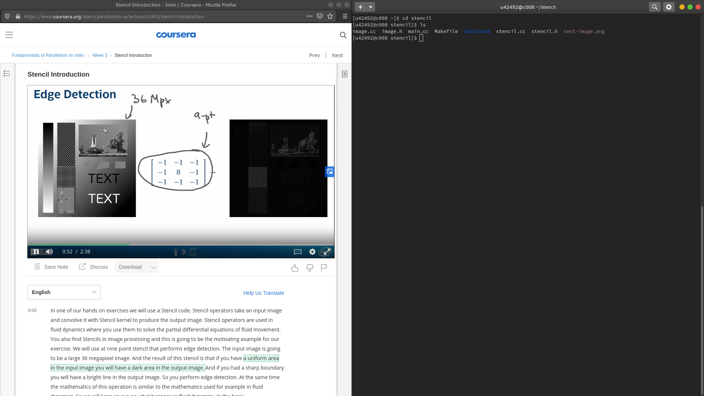
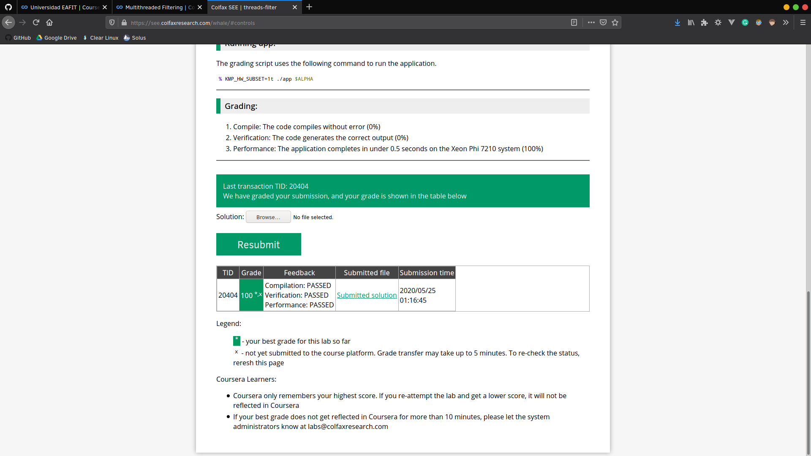

# Fundamentals of Parallelism on Intel Architecture

## 1. Week 1

### 1.1. Progreso

### 1.2. Quiz

### 1.3. Evaluación

### 1.4. Finalización

## 2. Week 3

### 2.1. Progreso

### 2.2. Quiz

### 2.3. Evaluación

### 2.4. Finalización

## 3. Week 5

### 3.1. Progreso

### 3.2. Quiz

### 3.3. Evaluación

### 3.4. Finalización

